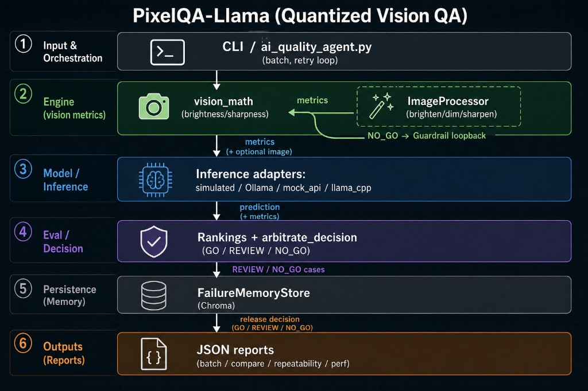
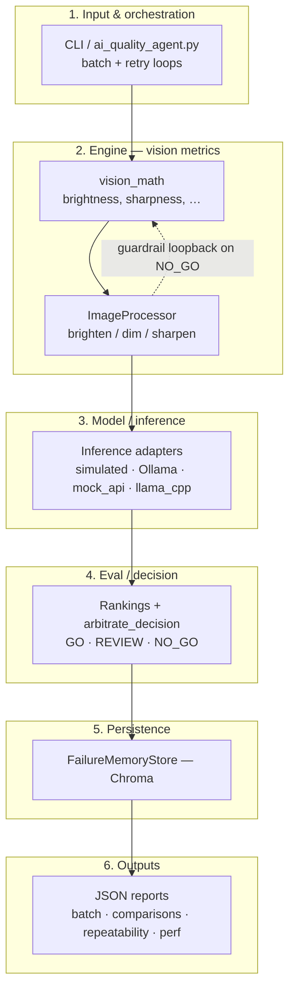

# Why 13 Years of Traditional QA Prepared Me for the “Chaos” of GenAI

**Published:** 2026-05-02  
**Audience:** QA engineers, ML/GenAI integrators, and anyone shipping probabilistic systems.

After 13 years in software quality assurance, I realized something unexpected: my most valuable skill was not just finding bugs in deterministic systems—it was **building trust in systems that are supposed to behave consistently**.

## Deterministic vs. probabilistic

In traditional software testing, the mental model is straightforward:

```text
Input A + Logic B = Output C
```

Deterministic. Repeatable. Verifiable.

In GenAI systems, that assumption breaks: **Prompt A + Model B** might produce **C** today, **D** tomorrow, and occasionally an unexpected hallucination.

Most teams still try to evaluate AI using a black-box mindset.

## A different approach: closed-loop reliability

I treat GenAI as a **closed-loop reliability engineering** problem. That mindset led me to build **Agentic Testing Framework**.

The goal was not simply to check whether a model can “pass” a test, but to understand deeper system behavior:

- **Consistency:** How often does the model drift from expected truth or prior outputs?
- **Observability:** Can we detect instability, oscillation, or over/under-correction patterns?
- **Self-correction:** Does feedback actually improve future inferences, or just shift the error?

## From Boolean testing to probabilistic evaluation

This is where the shift becomes fundamental: we are moving from **boolean testing** (pass/fail) to **probabilistic evaluation** (distribution + reliability). That is where experienced QA engineers become especially relevant.

We do not just detect failures—we define:

- the metrics that matter,
- the guardrails that stabilize behavior, and
- the evaluation loops that turn demos into reliable products.

Traditional QA is not outdated. It is the **missing layer of discipline** that prevents GenAI systems from drifting into unpredictability.

## Agentic Testing Framework (Quantized Vision QA)

**Agentic Testing Framework** is a configuration-driven pipeline: CLI orchestration, vision metrics and optional image processing, multi-backend inference, decision arbitration, failure memory (Chroma), and JSON reporting (batch, comparisons, repeatability, performance).



The same flow as a Mermaid overview (for readers who prefer text in-repo):



## Canonical links in this repo

- [Integrator guide](../integrator-guide.md) — runnable path and HTTP payload
- [Inference contract](../inference-contract.md) — `decision`, `code`, `msg`, `backend`
- [Minimal mock API example](../../examples/mock_api_roundtrip/README.md) — server, client, troubleshooting
- [Docs index](../README.md) — external articles table and publishing notes
