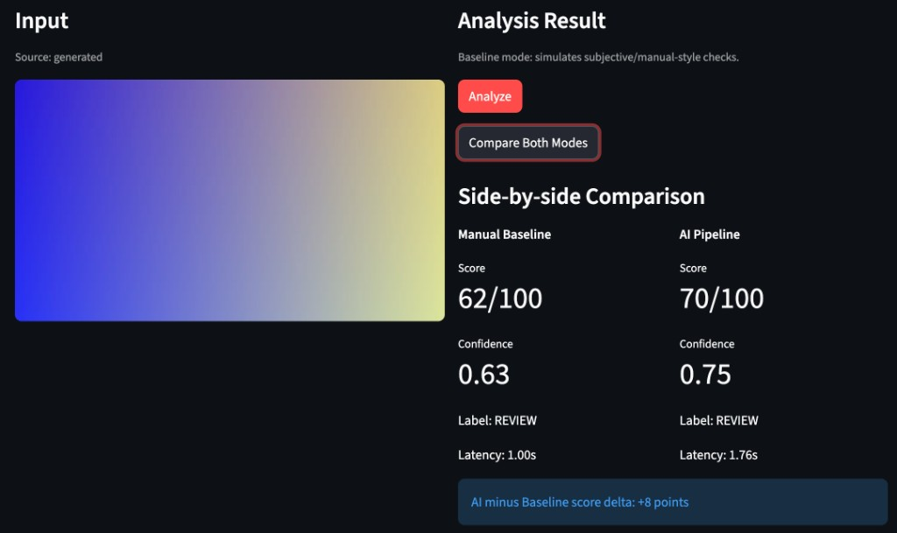

# Why LLM Outputs Break Your System — and How a QA Mindset Fixes It

**Published:** 2026-05-08  
**Audience:** Engineers integrating LLMs into production pipelines, agentic workflows, and RAG systems.

If you have ever integrated an LLM into a production pipeline, you have likely faced the **probabilistic nightmare**: the prompt is the same, the model is the same, but suddenly the system is down.

In recent work at the intersection of AI and test automation, the hardest part of LLM systems is not the prompting—it is managing **format drift**.

## The problem: structural fragility

LLM outputs are **probabilistic**, not structural. You expect clean JSON for downstream logic, but the model decides to be “helpful” and adds a paragraph of prose. If you feed raw outputs directly into an agentic pipeline, the system is not just smart—it is **inherently fragile**.

## The fix: inference provider abstraction

In **Agentic Testing Framework**, the approach moved away from “prompting and praying.” A dedicated **parsing and normalization** layer treats LLM output as **untrusted, unstructured text**.

### Three-step validation workflow

1. **Robust extraction:** Use regex and partial JSON parsing to pull the signal from the noise.
2. **Schema normalization:** Map variations (for example, “Positive,” “85%”) into standardized enum values.
3. **Pydantic validation:** Strict schema enforcement before data reaches core logic.

## From chaos to structure

A UI visualizes this transformation in real time.

**Baseline vs. AI pipeline:** In this run, the AI pipeline shows about **+8** points score delta versus the manual baseline. Latency is higher for the AI path (for example **1.76s** vs. **1.00s**), but the goal is to capture nuanced signal while keeping **Score**, **Confidence**, and **Labels** in a form the rest of the system can consume.

**Structural reliability:** Standardizing those fields means the model’s “reasoning” becomes **actionable** for downstream components instead of breaking parsers.

## The insight

**Reliability** is the bridge between a cool AI demo and a robust AI product. Traditional test automation reinforces one rule: **control the inputs, but never trust the outputs.**

---

To developers in the Taiwan and Greater China tech community: local industries are shifting hard toward agentic AI. How are you handling **output reliability** in RAG or agent workflows? Swap horror stories or best practices in the comments where you post this piece.

Tags: #AI #LLM #AgenticAI #SoftwareEngineering #Python #DevRel #AgenticTestingFramework #GenerativeAI #QA #TaiwanTech #TestAutomation

## Canonical links in this repo

- [Integrator guide](../integrator-guide.md) — runnable path and HTTP payload
- [Inference contract](../inference-contract.md) — `decision`, `code`, `msg`, `backend`
- [Minimal mock API example](../../examples/mock_api_roundtrip/README.md) — server, client, troubleshooting
- [Docs index](../README.md) — external articles table and publishing notes
