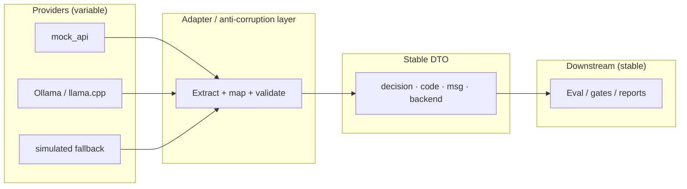

# Engineering the Inference Contract: Why `decision`, `code`, `msg`, and `backend`

**Published:** 2026-05-23  
**Audience:** Backend integrators, platform engineers, and anyone wiring third-party inference into a batch or agentic QA pipeline.

When you run more than one inference backend—`mock_api`, Ollama, `llama.cpp`, a cloud API, or a deterministic **simulated** shim—the failure mode is rarely “the model is wrong.”

It is **“the pipeline cannot parse what came back.”**  
The model is rarely the outage. **The parser is.**

> **Thesis:** **Normalization contains provider entropy.**  
> Inference providers are probabilistic.  
> **Your infrastructure should not be.**

## What an inference contract actually is

The contract is **less about AI** and more about **where entropy is allowed to exist**.

Provider-native payloads are noisy: envelope shape, field names, error semantics, and wording all drift. **Normalization contains that entropy** at one adapter boundary so evaluation, CI, metrics, and release logic stay deterministic.

Prompts persuade models. **Contracts protect pipelines.**

In integration terms, an **inference contract** is an **anti-corruption layer** for inference providers: provider-native JSON stops here; only a small, versioned DTO crosses into the rest of the system.

The fix is rarely a better prompt.  
It is a **stable contract**: that adapter boundary expressed as fields—`decision`, `code`, `msg`, and (recommended) `backend`—that every provider must normalize into **before** evaluation, logging, or release gates run.

This article explains how the **Agentic Testing Framework** public slice defines that surface, why each field exists, and how to validate your stack against it using the repo’s minimal mock roundtrip.

**Normative reference:** [`docs/inference-contract.md`](../inference-contract.md)  
**Runnable check:** [`examples/mock_api_roundtrip/`](../../examples/mock_api_roundtrip/)

---

## The problem: multi-backend without a shared shape

Integrators often start with provider-native JSON: nested `choices`, vendor error blobs, free-text `reasoning`, or Markdown-wrapped “JSON.” That works in a demo. In production it creates three classes of pain:

1. **Branch explosion** — every backend gets its own `if provider == …` parser in business logic.  
2. **Silent drift** — the model changes wording; automation that matched `msg` breaks.  
3. **Un-testable CI** — you cannot swap in a deterministic stub without re-implementing half the pipeline.

### A real-world failure pattern

A common failure pattern looked like this:

- **Backend A** returned:

  ```json
  { "result": { "decision": "...", "code": "...", "msg": "..." } }
  ```

- **Backend B** returned:

  ```json
  { "choices": [ { "message": { "content": "..." } } ] }
  ```

- **Backend C** wrapped JSON in Markdown fences (`` ```json `` … `` ``` ``).

Three weeks later:

- CI **silently skipped** retries (wrong branch on “success”).  
- Dashboards **mislabeled** failures (parsed `msg` instead of `code`).  
- Evaluation logic **forked by provider** (three paths to the same business rule).

The models were not failing.  
**The contract was.**

That boundary is the inference contract: **entropy stays on the provider side**; everything after normalization speaks one language.



*Normalize to contain entropy. Operate on what crosses the line.*

---

## Engineering taxonomy (one payload, four audiences)

The contract is one JSON object; **consumers are not interchangeable**. Assign each field a single primary audience and keep automation out of human text.

| Field | Primary audience | Owns |
|-------|------------------|------|
| `decision` | **Product / QA** | What the asset *means* for quality (labels dashboards and triage queues understand) |
| `code` | **Automation / orchestration** | Whether the pipeline should branch, retry, alert, or count success |
| `msg` | **Operators / humans** | Why a run looks the way it does (logs, tickets, UI copy) |
| `backend` | **Platform / observability** | *Who* produced this row (including fallback paths) |

**Anti-patterns (wrong owner):**

| Field | Do not use it for |
|-------|-------------------|
| `decision` | Retry policy or infra alerts without an eval/policy layer |
| `code` | Customer-facing wording or locale-specific copy |
| `msg` | CI gates, metric labels, or `if "timeout" in msg` branching |
| `backend` | Business QA labels (that is `decision`) |

Normative wording from the contract doc:

> **Machine path uses `code`; humans read `msg`; `decision` drives product QA labels.**

Put runbooks on `msg`. Put retries, metrics, and CI on `code`.

### Observability

Without a stable contract, **observability becomes provider-specific**—metrics, retries, and dashboards drift with each backend.

You cannot SLO what you cannot label consistently. **Normalize first; instrument second.**

| Field | Observability role |
|-------|-------------------|
| `code` | Metrics, alerts, retries, **SLOs** (low-cardinality `SUCCESS_*` / `ERR_*`) |
| `backend` | Trace/log **dimensions** (provider, fallback path) |
| `decision` | QA / product dashboards (asset quality, not uptime) |
| `msg` | Human **audit** trail only—not metric labels |

#### Metrics & SLOs

Branch on **`code`**, not `msg`. Service-level objectives belong here (did the inference path classify cleanly?); asset acceptability stays on **`decision` + eval**.

#### Tracing

Set span attributes at the adapter boundary—at minimum **`backend`**, often **`code`**—so a trace shows *which path* ran, not only HTTP 200.

#### Auditability

Use **`msg`** for operators (logs, tickets). Keep it out of cardinality-sensitive telemetry.

---

## Field-by-field semantics

### `decision` — product-facing QA label

| Property | Detail |
|----------|--------|
| **Audience** | Product / QA (see taxonomy) |
| **Type** | string (closed set) |
| **Role** | What the **image / asset** looks like from a QA perspective |
| **Valid values (v1)** | `Optimal`, `Blurry`, `Under-exposed`, `Over-exposed`, `Error` |

`decision` is **not** the same as a release gate (`GO` / `REVIEW` / `NO_GO`). Those live in the **evaluation** layer, which may combine `decision`, metrics, confidence, and policy. Keeping inference labels separate avoids overloading the model response with business rules that change per team or per SKU.

**`Error` as a decision:** Use when normalization succeeded structurally but the **inference path** failed in a product-meaningful way (e.g. unrecoverable backend failure classified for QA dashboards). Distinguish this from HTTP 5xx at the transport layer—your adapter should still return a parseable body when possible so batch jobs can record a row instead of aborting the whole run.

### `code` — machine-oriented status

| Property | Detail |
|----------|--------|
| **Audience** | Automation / orchestration (see taxonomy) |
| **Type** | string (stable vocabulary) |
| **Role** | Branching, metrics, alerts, retry policy |
| **Examples** | `SUCCESS_200`, `ERR_MODEL_BACKEND_503` |

**Do automate on `code`.** Treat it like an internal API: document additions, avoid renaming, prefer new codes over semantic overload. This is also your **stable hook for metrics, alerts, and retry orchestration**—the field observability stacks should key on (see taxonomy observability table).

**Do not** scrape `code` from natural language model output without a mapping table. LLMs do not guarantee vocabulary stability; your normalizer maps provider output to the enum you own.

### `msg` — human-readable explanation

| Property | Detail |
|----------|--------|
| **Audience** | Operators / humans (see taxonomy) |
| **Type** | string |
| **Role** | Logs, support tickets, UI tooltips |
| **Stability** | **Not** guaranteed for automation |

Wording changes across model versions, locales, and “helpful” rewrites. **`msg` is for people—not for `if` statements.**

Production still does this:

```python
if "timeout" in msg:
    retry()
```

If production logic depends on English phrasing, you do not have a machine contract. **You have log scraping.**

Once automation starts parsing human text, your contract is already broken. Encode the rule in **`code`** (or a dedicated structured field in a future contract version). Leave **`msg`** for operators reading logs—not for pipelines making decisions.

### `backend` — provenance and fallback transparency

| Property | Detail |
|----------|--------|
| **Audience** | Platform / observability (see taxonomy) |
| **Type** | string (recommended) |
| **Role** | Which provider produced this row |
| **Example** | `mock_api` |
| **Resilient setups** | May annotate fallback, e.g. `ollama->simulated` |

When remote inference fails and a **deterministic simulated** path answers instead, annotating `backend` prevents false confidence: the pipeline still ran, but not on the model you thought. That matters for debugging “why did this batch look green?”—and for **traceability**: dashboards and distributed traces should break out by `backend`, not by parsing provider-specific JSON shapes.

### Optional: `confidence`

Float in `[0, 1]` when the model supports it.

**Fake confidence is worse than none.** Omit the field.

---

## HTTP envelope: two accepted shapes

Providers may return either:

```json
{
  "result": {
    "decision": "Optimal",
    "code": "SUCCESS_200",
    "msg": "…",
    "backend": "mock_api"
  }
}
```

or a bare top-level object with the same fields inside.

The normalizer should:

1. Prefer `result` when present.  
2. Fall back to top-level fields.  
3. Reject or map to `Error` + a stable `code` when neither yields required keys.

This dual acceptance is a **backward-compatibility** choice: older stubs and quick curl tests often skip nesting; batch exporters may always wrap `result`.

---

## Backward compatibility and versioning

Treat [`inference-contract.md`](../inference-contract.md) as the **schema version** for this public slice.

| Practice | Why |
|----------|-----|
| **Add** optional fields before breaking changes | Clients ignore unknown keys |
| **Never rename** `code` values in place | Dashboards and retries depend on them |
| **Extend** `decision` only with explicit migration | Eval rules and reports key off labels |
| **Default missing `backend`** to `unknown` in logs, not silence | Easier incident triage |

When you need new semantics (e.g. a structured `retry_after_ms`), add a field—do not overload `msg`.

---

## From unstructured model text to stable DTO

This is normalization in practice: **contain entropy once**, then never parse provider shapes again.

At the **adapter boundary**, provider output is untrusted text until it becomes the contract. The mechanics match what the format-drift article describes; here is how they map onto `decision`, `code`, `msg`, and `backend`.

### 1. Robust extraction

- Strip Markdown fences (`` ```json ``).  
- Regex or brace-scan for the first JSON object.  
- On total failure: emit `decision: Error`, `code: ERR_PARSE_*`, `msg` with a short diagnostic (for humans only).

### 2. Schema normalization

Map provider-specific labels to the closed `decision` set, e.g.:

| Model might say | Normalize to |
|-----------------|--------------|
| sharp / clear / ok | `Optimal` |
| soft / out of focus | `Blurry` |
| too dark | `Under-exposed` |
| blown highlights | `Over-exposed` |

**Own the vocabulary in code. Rent it from the model**—via a mapping table in your repo, not a prayer in the prompt.

### 3. Strict validation before core logic

Validate required keys and types (Pydantic, JSON Schema, or equivalent) **once** at the boundary. Downstream modules receive only the DTO—never raw `choices[0].message.content`.

```text
Untrusted text → extract → map → validate → { decision, code, msg, backend? }
```

---

## `REVIEW` vs errors: where each layer lives

Readers from the **bounded self-healing** article may expect `REVIEW` on the inference response.

**Inference describes the asset. Evaluation decides the release.**

In this contract, **inference** answers “what does the model think about the asset?” **Evaluation** answers “what do we do with it?”

| Layer | Typical outputs | Driven by |
|-------|-----------------|----------|
| **Inference (this contract)** | `decision`, `code`, `msg` | Model + metrics snapshot |
| **Evaluation (downstream)** | `GO`, `REVIEW`, `NO_GO` | Policy, thresholds, repeatability |

Example: `decision: Blurry` with `code: SUCCESS_200` is a **successful** inference call that still may become **REVIEW** or **NO_GO** after arbitration. Conversely, `decision: Error` with `code: ERR_MODEL_BACKEND_503` signals the inference path failed in a way QA should see—even if HTTP was 200 with a structured body.

---

## Prove it locally: mock roundtrip

The public repo ships a **stdlib-only** server and client so you can verify wiring without the private monorepo.

**Start server** (`examples/mock_api_roundtrip/mock_server.py`):

- `POST /infer` with JSON: `photo_path`, `metrics`, `thresholds`.  
- Returns `{ "result": { "decision", "code", "msg" } }`.  
- Optional: `MOCK_INFER_API_KEY` → `Authorization: Bearer …`.

The stub applies a simple rule on `metrics.sharpness` (or `laplacian_variance`):

```python
decision = "Optimal" if sharp >= 30 else "Blurry"
result = {
    "decision": decision,
    "code": "SUCCESS_200",
    "msg": "mock_api_minimal stub classification",
}
```

**Run client** (`run_client.py`): POST sample metrics, print JSON. If you see `decision` and `code`, your HTTP stack matches what batch code expects.

Full steps: [`integrator-guide.md`](../integrator-guide.md) and [`examples/mock_api_roundtrip/README.md`](../../examples/mock_api_roundtrip/README.md).

**CI-minded next step:** Gate merges on `run_client.py` against a pinned mock server in CI—same contract, zero GPU, reproducible `code` and `decision`.

---

## Checklist for third-party backend authors

1. Return **both** machine and human fields: never only prose.  
2. Implement **either** envelope shape; document which you prefer.  
3. Map all failures to **`code`**; keep **`msg`** for people.  
4. Set **`backend`** (and `provider->fallback` when applicable).  
5. Do not require callers to parse Markdown or regex `msg`.  
6. Add integration tests against the mock server before touching production models.

---

## Further reading (this repo)

- [Inference contract (normative)](../inference-contract.md)  
- [Integrator guide](../integrator-guide.md) — mock server + client  
- [Mock API roundtrip](../../examples/mock_api_roundtrip/README.md)  

---

## Closing

**A model response is not an API contract.**

Your pipeline becomes reliable only when **every backend is forced through one**—the same anti-corruption boundary, the same taxonomy, the same hooks for metrics and retries.

Inference quality matters. But in production systems, **contract quality** determines whether the pipeline survives scale.

**Normalization contains provider entropy.** Everything after that line should behave like infrastructure—not like log scraping.

Tags: #API #Contract #Inference #QA #TestAutomation #Backend #JSON #AgenticAI #SoftwareEngineering #Observability #PlatformEngineering
