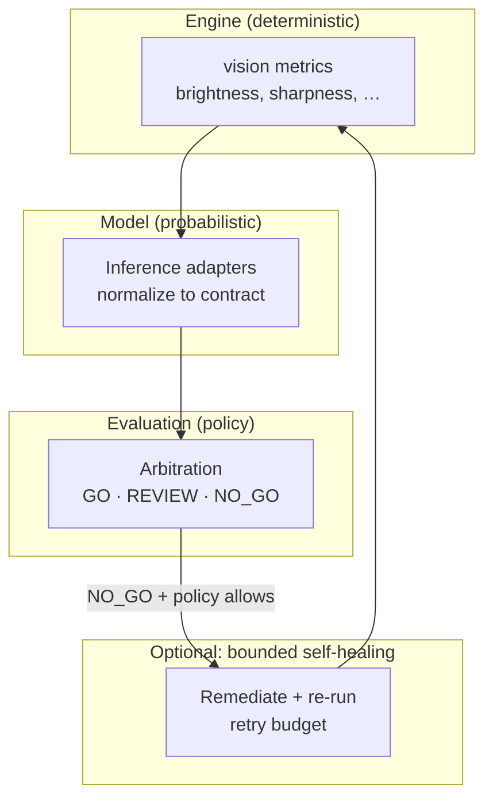

# From Inference Labels to Release Gates: GO, REVIEW, and NO_GO

**Published:** 2026-05-30  
**Audience:** Release owners, QA leads, and integrators who already normalized inference to `decision`, `code`, `msg`, and `backend`—and now need a **shipping policy** on top.

You fixed format drift. You wired the **inference contract**. Your mock roundtrip prints `SUCCESS_200` and `Optimal`.

Then product asks the question the contract alone cannot answer:

> **Can we ship this asset?**

That question belongs to a **different layer** than inference. In **Agentic Testing Framework**, it is answered by **release gates**: `GO`, `REVIEW`, and `NO_GO`.

This article closes the arc started in the earlier posts on probabilistic QA, bounded self-healing, and contract engineering: **inference describes the asset; evaluation decides the release.**

**Prior context in this series:**

- Mindset and pipeline shape: [Why traditional QA prepared me for GenAI](2026-05-02-why-traditional-qa-prepared-genai.md)  
- Normalization at the adapter: [Why LLM outputs break your system](2026-05-08-why-llm-outputs-break-your-system.md) · [Engineering the inference contract](2026-05-23-inference-contract-engineering.md)  
- Bounded recovery when quality fails: [Beyond pass/fail: bounded self-healing](2026-05-16-bounded-self-healing-vision-qa-probabilistic-evaluation.md)

**Normative inference surface:** [`docs/inference-contract.md`](../inference-contract.md)  
**Prove HTTP wiring:** [`examples/mock_api_roundtrip/`](../../examples/mock_api_roundtrip/)

---

## Two layers, one pipeline

Confusion usually appears when teams collapse **model output** and **release policy** into one field.

| Layer | Question it answers | Typical outputs | Who owns the vocabulary |
|-------|---------------------|-----------------|-------------------------|
| **Inference** | What does the model think about the **asset**? | `decision`, `code`, `msg`, `backend` | Adapter + contract (stable DTO) |
| **Evaluation** | What do we **do** with this row in the batch or release? | `GO`, `REVIEW`, `NO_GO` | Policy, thresholds, SKU rules |



The public slice in this repository documents and exercises **inference** (contract + mock server). **Release gates** live in the evaluation layer of the full framework—the same layer that combines metrics, `decision`, confidence, and repeatability before a batch report is final.

That split is intentional. Product rules change per team, locale, or campaign; **inference labels should not fork every time marketing tightens a threshold.**

---

## What each gate means

Treat gates as **actions for humans and automation**, not as synonyms for `decision`.

### `GO`

The asset **meets policy** for automatic acceptance in this run context.

- Downstream: index, publish, or mark the row green in a release dashboard.  
- Inference might still be imperfect prose in `msg`; the gate keys off **policy + stable signals** (`code`, metrics, `decision`), not English in `msg`.

### `REVIEW`

The asset is **not clearly shippable nor clearly rejectable**—or human judgment is required.

- Downstream: queue for spot-check, second model, or ops triage.  
- Common triggers: borderline sharpness, conflicting metric vs. `decision`, low confidence, first-time failure pattern worth learning from.

### `NO_GO`

The asset **fails policy** for this release.

- Downstream: block, rework, or enter a **bounded self-healing** loop (brighten, sharpen, re-infer) if policy allows—never unbounded “retry until green.”  
- A **successful** inference call (`code: SUCCESS_200`) can still yield **NO_GO** after evaluation. The model did its job; **policy** said no.

---

## Worked examples: same contract, different gates

The minimal mock server classifies only on sharpness:

```python
decision = "Optimal" if sharp >= 30 else "Blurry"
# always code SUCCESS_200 in the happy path
```

Evaluation in the full framework would **not** stop at that line. It would also consider `metrics`, `thresholds`, and policy. Illustrative combinations:

| `decision` | `code` | Metrics snapshot | Example gate | Why |
|------------|--------|------------------|--------------|-----|
| `Optimal` | `SUCCESS_200` | sharpness 45, exposure in band | **GO** | Model and metrics agree; above release floor |
| `Blurry` | `SUCCESS_200` | sharpness 28 (just under stub cut) | **REVIEW** | Model flagged blur; metrics near threshold—human or second pass |
| `Blurry` | `SUCCESS_200` | sharpness 12 | **NO_GO** | Clear fail; may trigger one bounded remediation attempt |
| `Under-exposed` | `SUCCESS_200` | brightness low | **NO_GO** → heal | Policy allows brighten + re-run within retry budget |
| `Error` | `ERR_MODEL_BACKEND_503` | n/a | **NO_GO** (no heal) | Inference path failed; fix backend, not pixels |

Notice the pattern:

- **`code`** tells you whether the **inference machinery** succeeded.  
- **`decision`** tells you the **QA label** for the asset.  
- **Gate** tells you whether **this release** accepts it.

A row can be `decision: Optimal` and still land **REVIEW** if, for example, repeatability checks show the same file flipped labels across backends—that is **probabilistic evaluation**, not boolean pass/fail.

---

## Arbitration: what evaluation actually combines

In the full **Agentic Testing Framework**, arbitration is closer to **scoring + policy** than to a single `if decision == …`.

Inputs commonly include:

1. **Normalized inference** — `decision`, `code`, optional `confidence`, `backend` (including `provider->simulated` when fallback ran).  
2. **Engine metrics** — deterministic measurements from `vision_math` (brightness, sharpness, etc.) sent with the request (`photo_path`, `metrics`, `thresholds` in the mock API shape).  
3. **Thresholds and SKU policy** — per-run or per-config limits, not hard-coded in the model prompt.  
4. **Repeatability / comparison context** — same asset across backends or across remediation attempts; rankings and deltas feed **REVIEW** more often than one-off blur.  
5. **Failure memory (optional)** — prior similar failures can elevate severity or route to review queues in the full framework pipeline (not in this public slice).

Outputs are **release gates** plus structured JSON reports (batch summaries, comparisons, repeatability, performance)—the persistence layer in the architecture diagram from the [intro article](2026-05-02-why-traditional-qa-prepared-genai.md).

**Rule of thumb for integrators:**

```text
Automate retries and alerts on code.
Label dashboards and triage on decision.
Ship or block on GO / REVIEW / NO_GO.
```

---

## How bounded self-healing fits (and where it stops)

The [self-healing article](2026-05-16-bounded-self-healing-vision-qa-probabilistic-evaluation.md) describes the loop:

```text
Engine → Model → Eval → (on NO_GO, if allowed) remediate → Engine → …
```

Important boundaries:

| Topic | Correct placement |
|-------|-------------------|
| Retry because HTTP 503 | Orchestration on **`code`** (`ERR_*`), may swap backend or use simulated fallback |
| Retry because image too dark | **Evaluation** returns **NO_GO**, policy allows **one** brighten step, then re-infer |
| Stop retrying | Oscillation detection, max attempts, gain caps—**evaluation + engine guardrails**, not the LLM |
| Escalate to human | **REVIEW** gate, not infinite remediation |

Self-healing is **not** “make the model agree with us.” It is **bounded engineering** around assets that almost pass policy.

---

## Anti-patterns that break releases

| Anti-pattern | Symptom | Fix |
|--------------|---------|-----|
| Map `Optimal` → `GO` in the adapter | Policy changes require adapter deploys | Arbitrate in **evaluation** using metrics + `decision` |
| Put `REVIEW` in inference JSON | Contract forks per team; parsers multiply | Keep `REVIEW` on **evaluation output** only |
| Branch on `msg` for gates | Breaks when the model rephrases | Encode rules in **`code`** and structured policy |
| Ignore `backend` when gate is `GO` | “Green” batch actually ran on **simulated** fallback | Treat `backend` as provenance; downgrade auto-**GO** when policy forbids fallback |
| Unbounded remediation | Quality drifts; cost spikes | Cap retries; detect oscillation (article 3) |

---

## What you can do in the public repo today

This repository stays small on purpose. You can already:

1. **Normalize inference** — run [`mock_server.py`](../../examples/mock_api_roundtrip/mock_server.py) + [`run_client.py`](../../examples/mock_api_roundtrip/run_client.py); confirm `decision` and `code`.  
2. **Document your gate policy** — even a table like the worked examples above, keyed off `metrics` + `decision`, gives release owners a shared language before touching the full framework batch CLI.  
3. **CI-gate the contract** — merge checks on stable `code` and required keys; do **not** assert exact `msg` wording.

What requires the **full framework pipeline** (not in this public repository): batch orchestration, `arbitrate_decision`, Streamlit comparisons, Chroma failure memory, and JSON reports with gate columns.

The README states this honestly: inference here answers *what the model thinks*; **release gates** live downstream. This article is the map for that downstream—not a second contract duplicated in the mock server.

---

## Checklist for release owners and integrators

1. **Freeze inference** — all backends return the same DTO ([contract article](2026-05-23-inference-contract-engineering.md)).  
2. **Write policy separately** — thresholds in config, not in prompts.  
3. **Define three gate behaviors** — what automation does on `GO`, who owns `REVIEW` queues, what remediation is allowed on `NO_GO`.  
4. **Log provenance** — always persist `backend` on the row when explaining a surprising `GO`.  
5. **Report gates in batch JSON** — not only `decision`, so product and ops read the same field.  
6. **Rehearse failure modes** — `SUCCESS_200` + bad asset vs. `ERR_*` + `decision: Error`; gates and retries differ.

---

## Closing

A green **`code`** is not a green **release**.

**Agentic Testing Framework** separates **inference reliability** (contract, normalization, observability on `code` and `backend`) from **release reliability** (`GO` / `REVIEW` / `NO_GO` on policy and metrics).

If you have been following this series: you started with QA discipline for chaos, fixed structural fragility, added bounded recovery, and engineered a stable inference surface. The next step in production is not a fifth prompt—it is **explicit arbitration** so every asset row answers both “what is it?” and “do we ship it?”

Tags: #QA #ReleaseEngineering #AI #ComputerVision #TestAutomation #AgenticAI #SoftwareEngineering #PlatformEngineering #AgenticTestingFramework

## Canonical links in this repo

- [Inference contract (normative)](../inference-contract.md)  
- [Integrator guide](../integrator-guide.md) — mock server + client  
- [Mock API roundtrip](../../examples/mock_api_roundtrip/README.md)  
- [Docs index](../README.md) — article index
