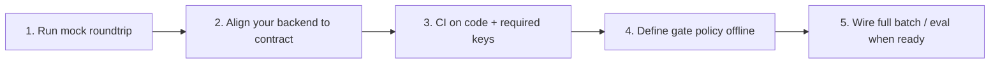

# What the Public Repo Actually Gives You — Public Slice vs. Full Agentic Testing Framework

**Published:** 2026-06-06  
**Audience:** Integrators who found [agentic_testing_framework_public](https://github.com/CHDev2116/agentic_testing_framework_public) on GitHub and want to know—honestly—what to run here vs. what still lives in the full pipeline.

This is a **live-share** post in the series (6 of 8): not a new algorithm, but a map so you do not waste a sprint wiring the wrong repo.

**Series so far:**

1. [Why traditional QA prepared me for GenAI](2026-05-02-why-traditional-qa-prepared-genai.md)  
2. [Why LLM outputs break your system](2026-05-08-why-llm-outputs-break-your-system.md)  
3. [Beyond pass/fail: bounded self-healing](2026-05-16-bounded-self-healing-vision-qa-probabilistic-evaluation.md)  
4. [Engineering the inference contract](2026-05-23-inference-contract-engineering.md)  
5. [From inference labels to release gates](2026-05-30-from-inference-labels-to-release-gates.md)  

---

## Why this repo exists

**Agentic Testing Framework** grew as a configuration-driven vision QA pipeline: engine metrics, multi-backend inference, normalization, evaluation gates, optional failure memory, JSON reports.

Publishing the **entire** monorepo would mix three problems:

1. **Reproducibility** — readers need copy-paste commands that work on a laptop in minutes.  
2. **Honesty** — some pieces (batch CLI at scale, internal datasets, full Chroma workflows) are not meant for a public drop.  
3. **Focus** — the integration pain we hear most is: *“Every inference provider returns a different JSON shape.”*

So the public home is deliberately a **slice**: versioned docs, a normative contract, and a **stdlib-only** mock roundtrip.

```text
Public repo  = contract + integrator path + minimal HTTP example
Full framework = batch orchestration + eval arbitration + reports + optional memory + UI
```

That is not “open core as marketing.” It is **scope control** so the canonical surface stays small and testable.

---

## What you get here (today)

| Asset | Path | What it proves |
|-------|------|----------------|
| **Inference contract** | [`inference-contract.md`](../inference-contract.md) | Stable `decision`, `code`, `msg`, optional `backend` |
| **Integrator guide** | [`integrator-guide.md`](../integrator-guide.md) | ~3 minutes: server + client |
| **Mock roundtrip** | [`examples/mock_api_roundtrip/`](../../examples/mock_api_roundtrip/) | Your HTTP stack speaks the same JSON shape as `mock_api` in the full framework |
| **Article series** | [`docs/README.md`](../README.md) | Mindset → normalization → self-healing → contract → gates → (this post) |

**60-second proof:**

```bash
cd examples/mock_api_roundtrip
python3 mock_server.py   # terminal 1
python3 run_client.py    # terminal 2
```

You should see `decision` and `code` in the response. No GPU. No API keys.

---

## What is intentionally *not* duplicated here

The root README states this plainly. Worth repeating because expectations drift:

| Capability | In public slice? | Where it lives in the full framework |
|------------|------------------|--------------------------------------|
| Release gates `GO` / `REVIEW` / `NO_GO` | Documented, not executed in mock | Evaluation / `arbitrate_decision` |
| Bounded self-healing (brighten, sharpen, re-run) | Described in articles | Engine + eval loop with retry caps |
| Batch CLI over large folders | No | Private / full monorepo |
| Streamlit comparison UI | No | Full monorepo |
| Failure memory (Chroma) | No | Full monorepo |
| Full test suite + org CI | Minimal example only | Full monorepo |

If you clone public expecting a one-command batch over 10k images, you will feel the repo is “incomplete.” **It is complete for its job: validate the inference boundary.**

---

## Adoption path (what to do in order)



### Step 1 — Trust the wire

Run the mock server and client. Fix port, auth (`MOCK_INFER_API_KEY`), and envelope parsing before touching a real model.

### Step 2 — Normalize your backend

Map provider JSON to the contract at **one adapter**. See [inference contract engineering](2026-05-23-inference-contract-engineering.md).

### Step 3 — CI the contract, not the prose

Gate merges on stable `code` and required fields—not exact `msg` wording. (Article 7 in this series will go deeper.)

### Step 4 — Write release policy separately

`decision: Optimal` is not automatically `GO`. See [release gates article](2026-05-30-from-inference-labels-to-release-gates.md).

### Step 5 — Plug into the full pipeline when needed

Batch reports, repeatability across backends, and Streamlit diffs are worth it at volume—they are just not prerequisites to prove your HTTP integration.

---

## FAQ (from DMs and comments)

**“Is the public repo abandoned if the batch CLI isn’t here?”**  
No. The contract and example are the **integration source of truth**. Articles link here so Medium/LinkedIn posts do not rot when commands change.

**“Can I ship production QA with only the mock?”**  
You can ship **integration tests** and **adapter development**. Production asset decisions still need your model, metrics, and gate policy—the mock is a stub, not a VLM.

**“Why mention a private monorepo at all?”**  
So you do not file issues asking for Chroma in a repo that never promised it. The split is documented, not hidden.

**“I’m in Taiwan / Greater China building agentic pipelines—where do I start?”**  
Same path: mock → contract → your backend → policy. Local inference (Ollama, llama.cpp) fits **behind** the adapter; the public surface does not care which engine you use as long as normalization is consistent.

---

## What comes next in the series (7–8)

| # | Target | Focus |
|---|--------|--------|
| 7 | ~06-13 | Contract in CI (`run_client.py` as a merge gate) |
| 8 | ~06-20 | Mock → your production HTTP backend (integrator checklist) |

After #8 we rotate topics. This repo stays the **canonical home** for commands and schemas.

---

## Closing

**Small public repo ≠ small ambition.** It means we publish only what stays reproducible and versioned.

If you have been following since article 1: the story was never “clone and magic batch.” It was **discipline for probabilistic systems**—and this repository is the part you can fork, run, and cite in a PR today.

Tags: #OpenSource #QA #AI #PlatformEngineering #TestAutomation #AgenticAI #SoftwareEngineering #DevRel #AgenticTestingFramework

## Canonical links in this repo

- [Repository root](https://github.com/CHDev2116/agentic_testing_framework_public)  
- [Integrator guide](../integrator-guide.md)  
- [Inference contract](../inference-contract.md)  
- [Mock API roundtrip](../../examples/mock_api_roundtrip/README.md)  
- [Docs index](../README.md) — external articles table
