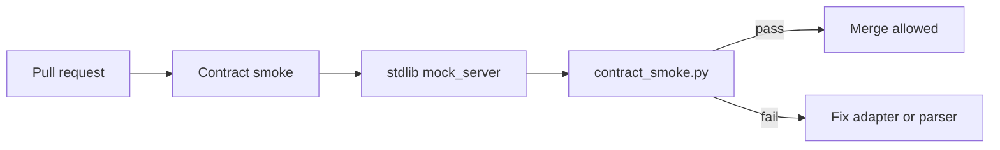

# Gating Merges on the Inference Contract: CI Without GPUs or API Keys

**Published:** 2026-06-13  
**Audience:** Platform engineers and integrators who documented an inference contract (article 4) and now need **merge-time enforcement**—without calling a live model in CI.

Article 7 in the series (of 8). Article 4 argued that **normalization contains provider entropy**.  
Article 6 clarified what this public repo proves vs. what lives in the full pipeline.

This post closes the loop for integrators: **how to gate PRs on the contract** using the stdlib mock in this repository—deterministic, free, and fast.

**Prior context:**

- [Engineering the inference contract](2026-05-23-inference-contract-engineering.md)  
- [Public slice vs. full framework](2026-06-06-public-slice-vs-full-framework.md)  

**Normative fields:** [`inference-contract.md`](../inference-contract.md)  
**Runnable smoke:** [`examples/mock_api_roundtrip/ci_smoke.sh`](../../examples/mock_api_roundtrip/ci_smoke.sh)  
**GitHub Actions:** [`.github/workflows/contract-smoke.yml`](../../.github/workflows/contract-smoke.yml)

---

## The gap: documented contract, unenforced wiring

Teams often stop at:

```bash
python3 mock_server.py   # terminal 1
python3 run_client.py    # terminal 2 — looks fine
```

Then someone refactors the HTTP client, changes envelope parsing, or drops `code` from a refactor—and **nothing fails until production**.

The contract doc is not a contract until **CI breaks the merge** when the wire shape drifts.



No GPU. No API keys. No flaky VLM calls.

---

## What to assert (and what not to)

| Assert in CI | Why |
|--------------|-----|
| HTTP **200** on `/infer` with sample payload | Transport + handler alive |
| **`decision`**, **`code`**, **`msg`** present | Minimum DTO from [`inference-contract.md`](../inference-contract.md) |
| **`decision`** in closed set | Catches garbage labels early |
| **`code`** non-empty string | Machine path exists for metrics/retries |
| Envelope: `result.{...}` **or** top-level fields | Both shapes accepted per contract |

| Do **not** assert in CI | Why |
|-------------------------|-----|
| Exact **`msg`** wording | Model and copy change; not machine-stable |
| Specific **`decision`** for every run | Stub may return `Blurry` on low sharpness—that is valid |
| Live model quality | Non-deterministic; belongs in eval / offline baselines |
| Release gates **`GO` / `REVIEW` / `NO_GO`** | Evaluation layer—not inference contract smoke |

**Rule:** CI proves **structure and vocabulary**; release policy proves **shippability** ([article 5](2026-05-30-from-inference-labels-to-release-gates.md)).

---

## What this repo ships

Three pieces work together:

| File | Role |
|------|------|
| [`mock_server.py`](../../examples/mock_api_roundtrip/mock_server.py) | Deterministic `/infer` stub |
| [`contract_smoke.py`](../../examples/mock_api_roundtrip/contract_smoke.py) | POST + validate required fields; **exit 1** on violation |
| [`ci_smoke.sh`](../../examples/mock_api_roundtrip/ci_smoke.sh) | Start server in background, run smoke, clean up |

[`run_client.py`](../../examples/mock_api_roundtrip/run_client.py) remains the **human-friendly** printer for local debugging.  
[`contract_smoke.py`](../../examples/mock_api_roundtrip/contract_smoke.py) is the **automation-friendly** gate.

### Run locally (same as CI)

```bash
bash examples/mock_api_roundtrip/ci_smoke.sh
```

Expected output (shape may vary slightly):

```json
{
  "status": "ok",
  "decision": "Optimal",
  "code": "SUCCESS_200"
}
```

Exit code **0** means the contract smoke passed.

### What `contract_smoke.py` checks

1. POST JSON: `photo_path`, `metrics`, `thresholds` (same as integrator guide).  
2. Parse response JSON.  
3. Normalize `result` wrapper if present.  
4. Require string fields `decision`, `code`, `msg`.  
5. Require `decision ∈ { Optimal, Blurry, Under-exposed, Over-exposed, Error }`.  
6. **Does not** compare `msg` to a golden string.

Optional auth: set `MOCK_INFER_API_KEY` on both server and smoke (same as [`integrator-guide.md`](../integrator-guide.md)).

---

## GitHub Actions (this repository)

Workflow: [`.github/workflows/contract-smoke.yml`](../../.github/workflows/contract-smoke.yml)

```yaml
- name: Inference contract smoke (stdlib mock)
  run: bash examples/mock_api_roundtrip/ci_smoke.sh
```

Triggers on **push** and **pull_request** to `main` / `master`.  
Typical runtime: a few seconds on `ubuntu-latest`.

Add a branch protection rule: **require `Contract smoke` to pass** before merge.

---

## Port to your adapter repository

You do not need to copy the mock server forever. Typical adoption:

### Phase 1 — Wire against this public mock (today)

Point your adapter integration tests at `agentic_testing_framework_public`’s mock shape, or vendor `contract_smoke.py` and run it in CI against your own stub that claims `mock_api` compatibility.

### Phase 2 — Swap URL, keep the same assertions

When your real HTTP backend is available in a test environment:

```bash
export MOCK_INFER_URL=https://your-staging.example/infer
python3 contract_smoke.py
```

Keep the **same field checks**. Change only the URL (and auth headers).

### Phase 3 — Add error-path cases (optional)

Extend smoke with table-driven cases:

| Scenario | Expect |
|----------|--------|
| Happy path | `code` like `SUCCESS_*`, valid `decision` |
| Backend down | HTTP 5xx or structured `decision: Error` + `ERR_*` `code` |
| Malformed provider JSON | Your **adapter** returns parseable contract body, not raw prose |

Still avoid asserting `msg` text.

---

## Anti-patterns

| Anti-pattern | Result |
|--------------|--------|
| CI calls production VLM | Flaky, costly, non-reproducible |
| Snapshot entire JSON including `msg` | Breaks on harmless rewording |
| Only `run_client.py` with no exit-code check | Green CI when fields missing |
| Skip smoke because “we have unit tests” | Unit tests mock away HTTP; wire drift hides |
| Assert `decision: Optimal` always | Confuses inference smoke with release policy |

---

## Checklist

1. **Normative doc** — [`inference-contract.md`](../inference-contract.md) linked from your adapter README.  
2. **Smoke script** — exits non-zero on missing/invalid `decision`, `code`, or `msg`.  
3. **CI job** — runs smoke on every PR; no GPU dependency.  
4. **Branch protection** — required check enabled.  
5. **Staging URL** — same smoke against pre-prod backend before go-live.  
6. **Separate eval gates** — `GO` / `REVIEW` / `NO_GO` tested elsewhere, not in contract smoke.

---

## Closing

A contract that lives only in Markdown is documentation.  
A contract that **fails CI** when the wire breaks is engineering.

This public slice gives you a **stdlib-only, deterministic** path to that gate. Use the mock to prove your stack today; keep the same assertions when you swap in staging and production backends tomorrow.

Tags: #CI #QA #API #Contract #TestAutomation #PlatformEngineering #AgenticAI #SoftwareEngineering #AgenticTestingFramework

## Canonical links in this repo

- [Inference contract (normative)](../inference-contract.md)  
- [Integrator guide](../integrator-guide.md)  
- [Mock API roundtrip README](../../examples/mock_api_roundtrip/README.md)  
- [Contract smoke script](../../examples/mock_api_roundtrip/contract_smoke.py)  
- [CI wrapper script](../../examples/mock_api_roundtrip/ci_smoke.sh)  
- [GitHub Actions workflow](../../.github/workflows/contract-smoke.yml)  
- [Docs index](../README.md) — article index
